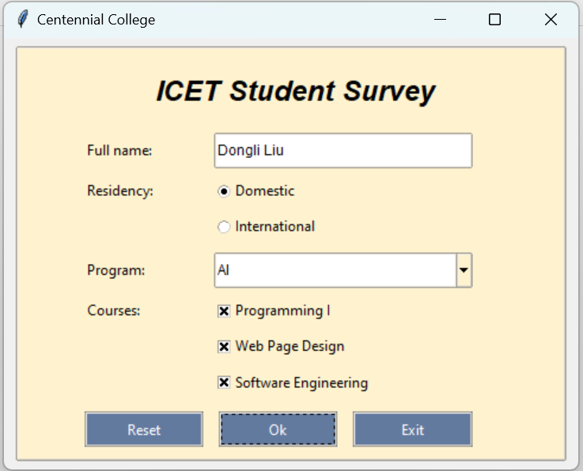

<h1 align="center"> Python GUI - Survey App </h1>

# ICET Student Survey GUI

This project implements a simple graphical user interface (GUI) using Tkinter, a standard GUI toolkit for Python, to conduct a student survey. The survey collects information such as the student's name, residency status, chosen program, and selected courses.

## Requirements

- Python 3.x
- Tkinter

## Installation

To run the application, ensure you have Python installed on your system. You can download Python from the [official website](https://www.python.org/downloads/).

No additional installation is required for Tkinter, as it is included in the standard library of Python.

## Usage

1. Clone or download the project files to your local machine.

2. Open a terminal or command prompt and navigate to the project directory.

3. Run the `main.py` file:

    ```bash
    python main.py
    ```

4. The survey GUI window will appear, allowing you to input the required information.

5. Click the "Ok" button to submit the survey. A message box will display the collected information.

6. Click the "Exit" button to close the application.

## Features

- Collects student information including name, residency status, program, and selected courses.
- Provides a visually appealing interface with proper styling and layout.
- Supports dynamic resizing of the window and font adjustments.
- Displays collected information in a message box for easy review.


